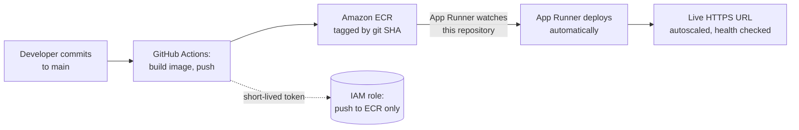
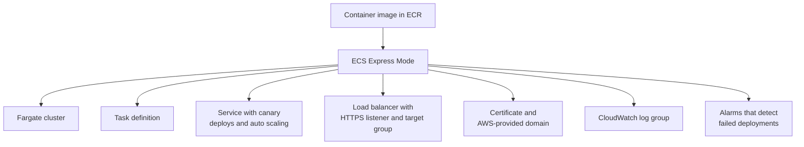

# CI/CD teaching track: commit to production on AWS

From davedat., 2026-09-13.

A cleaned public version of this research, with the one-session S3 design as the main plan, is published at `info/sessions/2026-fall/TBD-cicd-on-aws/` (2026-09-16). Keep internal discussion here and technical content there.

This replaces the S3-only design in the first draft of [events/cicd-track/s3-fallback-proposal.md](s3-fallback-proposal.md). The goal is the one that was asked for. A developer commits, the change builds into a container image, and the image deploys itself to production on AWS. The other goal is that nobody suffers to get there, which is what the target section below is about.

## The scope problem, stated first

Commit to production with containers is not one 90-minute session. It is two. Pretending otherwise is how a workshop dies at the halfway mark with most of the room stuck.

Two different things are being taught and they fail in different places.

The pipeline covers GitHub Actions, authenticating to AWS, building an image, and pushing it to a registry. It fails at the YAML and at permissions.

The runtime covers whatever receives the image and turns it into a running, load-balanced, HTTPS service. It fails at networking and health checks.

Most tutorials teach the pipeline and skip the runtime. That is why people finish a tutorial able to push an image and still unable to ship anything. A club can do better, but only by giving the material the time it needs.

Run two sessions. Session 1 gets a container image running on a real production URL. Session 2 turns that into a pipeline and covers what production demands. If only one slot is available, run Session 1 and demo Session 2. Do not compress both into one.

## Choosing the deploy target

The goal is teaching how CI/CD on AWS works, without a painful path. The pain is not in the deploy target. The pain is in how much each student has to build before anything runs. That is the lever to pull, and it can be pulled on any target.

Four options, ordered by how much a student has to do before their first deploy.

| Target | Student effort | What the workflow does | Cost shape | Teaches |
|---|---|---|---|---|
| S3 static site | Lowest | `aws s3 sync` | Effectively free | The pipeline shape only. No containers, no health checks |
| App Runner | Low | Build and push to ECR. Nothing else | Per second of compute, no load balancer. Service can be paused | Containers, health checks, rolling deploys, HTTPS |
| ECS Express Mode | Medium | Build, push, then update the service | Fargate plus a shared load balancer | The same, on the orchestrator used in industry |
| EC2 with Docker | Highest | Build, push, then reach into the instance | An always-on instance per student | Mostly how to configure a deploy agent |

### Recommendation: App Runner

App Runner watches an ECR repository and deploys on its own. The AWS documentation is explicit that whenever you push a new image version to your image repository, App Runner deploys it to your service without further action on your side.

That one behaviour removes the hardest part of the workshop. The GitHub Actions workflow builds the image and pushes it. There is no deploy step, no ECS permissions in the IAM role, and no task definition. The student's pipeline is about fifteen lines.

App Runner gives an HTTPS URL, auto scaling, health checks, and rolling deployments with no load balancer to configure and no load balancer bill. It can also be paused, which matters for teardown.

Turn automatic deployment on deliberately. It is off by default for images from a public ECR repository or an ECR repository in another account, and App Runner does not support automatic deployment in those two cases at all. Use a private ECR repository in the same account.

The honest tradeoff: App Runner appears in fewer job postings than ECS. A student who learns this will meet ECS or Kubernetes at work. What transfers is the pattern, which is identical. Build an image, tag it immutably, push it to a registry, let something watch the registry and roll the service. The ceremony differs. The pattern does not.

### The step up: ECS Express Mode

Once the pattern lands, ECS Express Mode is the natural next rung, and [it is worth showing even if nobody builds it](https://aws.amazon.com/about-aws/whats-new/2025/11/announcing-amazon-ecs-express-mode/). AWS announced it in November 2025 and it runs in all regions at no additional charge.

You give it a container image and it creates the following in your own account.

Building that by hand takes roughly 45 minutes of task definition JSON, target group wiring, and security group debugging. None of it is the lesson. Express Mode also creates standard resources students can change afterwards, so it is a starting point rather than a dead end. Up to 25 Express services share one load balancer, which keeps a classroom affordable.

Use it as the second half of Session 2, demonstrated rather than built, or as the target if the club later wants a deeper DevOps event.

### Why not EC2 with Docker

EC2 with Docker was in the original request, so here is the reasoning against it.

Running a container on an instance is the most familiar mental model, but the deploy step is the problem. Getting a new image onto a running instance means AWS Systems Manager Run Command, or CodeDeploy with an agent, or an SSH key in GitHub Secrets.

The CodeDeploy route is not a shortcut. The AWS setup involves installing the agent on the instance, creating an IAM user with CLI credentials, registering the instance, copying a configuration file into `/etc/codedeploy-agent/conf/`, and restarting the service. Per instance. Multiply by thirty students and it is the most painful option on the list, which is the opposite of the goal.

The SSH key route is the long-lived credential mistake in different clothes.

You also end up building by hand everything App Runner and Express Mode provide, including HTTPS, health checks, and rolling replacement. Skipping those means teaching a deploy with downtime and no rollback, which is not production.

Teach EC2 in the AWS 101 workshop, where it answers the question of what a server is. Teach the pipeline here, where a managed runtime earns its place.

### Authenticate with OIDC, never with stored keys

Use OIDC either way. OIDC credentials expire after each workflow run, so no long-lived AWS keys sit in the repository.

The alternative is generating an IAM access key and pasting it into GitHub Secrets. Most tutorials do this. It is also the most common way a student project turns into an incident. Creating thirty permanent AWS keys inside thirty student GitHub accounts is a bad thing to do on purpose.

With App Runner the role needs one permission set, pushing to one ECR repository. That is a much smaller thing to explain than a role that can update ECS services.

Build the trust policy in advance. Ship a CloudFormation template that creates the OIDC provider, a role scoped to the student's repository, the ECR repository, and the App Runner service pointed at it. Students launch the stack and paste in a role ARN. They see the trust policy explained on screen without typing it.

## Cost

Read this before committing. The S3 version cost nothing. This one costs a little, and the amount depends on which target gets picked.

App Runner bills published rates of $0.064 per vCPU-hour for active compute and $0.007 per GB-hour of provisioned memory. You pay memory for every provisioned instance and CPU only for the ones actively serving. There is no load balancer, which is where most of the cost would otherwise sit. AWS publishes a worked example of a test application running two hours a day that comes to $4.80 a month.

For a 90-minute session with thirty students on 1 vCPU and 2 GB each, that is roughly three to four dollars for the whole room. Verify it with the AWS Pricing Calculator before publishing, but the order of magnitude is small.

ECS Express Mode adds a load balancer. Express services on the same subnet configuration share one, up to 25 per balancer, so thirty students need about two rather than thirty. The session itself stays cheap. A forgotten load balancer does not.

The session is not the risk. The risk is a student who does not tear down. On the current AWS free plan a forgotten service cannot produce a surprise bill, but it quietly burns the $100 to $200 of credits the student was going to spend on their own projects, and the account closes at six months either way.

App Runner helps here too, because a service can be paused rather than deleted, and a paused service only carries provisioned memory. Deleting is still the right instruction. Pausing is the recovery path for anyone who wants to keep their work.

Four consequences follow.

Teardown is a gate, not a closing slide. Nobody leaves until their service is deleted or paused, confirmed screen by screen.

Every student sets a billing alarm during the session. Make it a step, not advice.

Somebody prices the chosen target in the AWS Pricing Calculator and puts the real figure on a slide. Saying it costs a few dollars is not good enough when the money is a student's own credits.

Somebody with club account access writes a cleanup script and runs it the next day. Assume people will leave without tearing down, because they will.

## Session 1: container to production, by hand

90 minutes, no pipeline yet. Everyone finishes with a live HTTPS production URL serving their own container.

| Time | Segment | What happens |
|---|---|---|
| 0 to 10 | Setup check | AWS account works, Docker installed or CloudShell open |
| 10 to 25 | What a container is | Image against container, and why "works on my machine" stops being a sentence people say |
| 25 to 40 | Write a Dockerfile, build locally | Small web app, one Dockerfile, running on localhost |
| 40 to 55 | Push to ECR | Authenticate, tag, push. The first time the image leaves their laptop |
| 55 to 75 | Create the App Runner service | Point it at the image, turn on automatic deployment, open the HTTPS URL |
| 75 to 85 | Teardown, gated | Delete or pause the service. Set a billing alarm. Confirm around the room |
| 85 to 90 | What is still manual | Everything they just did by hand is what Session 2 automates |

Do it manually first. Automation only lands as relief if the audience has felt the work being automated. A room that has tagged and pushed an image, then clicked through a deployment, understands why a pipeline exists. A room that starts with the pipeline sees YAML.

## Session 2: the pipeline, and what production means

90 minutes. Automate Session 1, then cover what tutorials skip.

| Time | Segment | What happens |
|---|---|---|
| 0 to 10 | Recap and setup | Everyone forks the template repository |
| 10 to 25 | Launch the CloudFormation stack | Creates the OIDC provider, scoped role, ECR repository, and App Runner service. Explain the trust policy while it runs |
| 25 to 40 | Read the workflow file together | Line by line. Nobody types it, everybody understands it |
| 40 to 55 | Push and watch it deploy | Edit a heading, commit, watch the Actions tab, refresh the URL |
| 55 to 70 | Break it on purpose | Ship a container that fails its health check. Watch the deployment fail and the old version keep serving |
| 70 to 85 | What production demands, and the step up | The five points below, then ECS Express Mode demonstrated |
| 85 to 90 | Teardown, gated | Same as Session 1 |

### The five points that separate this from a tutorial

Protect this segment. It is what nobody else teaches.

Never deploy the tag `latest`. Tag every image with its git SHA. A mutable tag means you cannot say what is running in production and you cannot roll back to a specific build. This is the most common production mistake and one line of YAML avoids it.

A deployment is not finished when the pipeline turns green. It is finished when the new version passes its health check and takes traffic. Show a green pipeline that shipped a broken application, and show the old version still serving because the new one never went healthy.

Plan the rollback before you need it. Because images carry their SHA, rolling back means redeploying the previous tag. Do it live.

Keep secrets out of the image and out of the repository. Read them at runtime from SSM Parameter Store or Secrets Manager. Say plainly that a secret baked into an image layer stays in that image forever, even when a later layer deletes the file.

Production should not be the first place a change runs. Use staging, then a gated promotion. GitHub Environments with a required reviewer is the cheapest version and takes two minutes to demonstrate.

### Break it on purpose, and do not cut this

Every attendee will hit a failed deployment within a month of their first real project or job. If the only pipeline they have seen is one that worked, a red X and a rolled-back service is frightening and opaque. If they have deliberately shipped a container that fails its health check and watched the platform refuse to cut traffic over to it, the same event is ordinary.

Workshops skip this because ten minutes on failure feels wasteful. It is the part that transfers.

## Why not EC2 with Docker

EC2 with Docker was in the original request, so here is the reasoning for leaving it out.

Running a container on an EC2 instance is the most familiar model, but the deploy step is the problem. Getting a new image onto a running instance means SSM Run Command, or CodeDeploy with an agent, or an SSH key in GitHub Secrets. The first two need more configuration than ECS Express Mode does. The third is the long-lived credential mistake in different clothes.

You also end up building by hand everything Express Mode provides, including the load balancer, HTTPS, health checks, and rolling replacement. Skipping those means teaching a deploy with downtime and no rollback, which is not production.

Teach EC2 in the AWS 101 workshop, where it answers the question of what a server is. Teach containers here, where a managed runtime earns its place.

## What has to be built beforehand

| Item | Notes |
|---|---|
| Template repository with a small web app, a Dockerfile, and the workflow file | Fork and go. One heading they will edit |
| CloudFormation template creating the OIDC provider, scoped role, ECR repository, and App Runner service | The fiddly piece, and the club builds it once so thirty students do not each build it. Scope the trust policy to one repository and the permissions to one ECR repository |
| One-click stack launch URL | So nobody mistypes a stack name |
| Real cost figures from the AWS Pricing Calculator | For the slide, and for the go or no-go on this design |
| Cleanup script for leftover services | Assume some attendees leave without tearing down |
| Troubleshooting page for helpers | Health check failures, ECR authentication, OIDC trust policy mismatches |
| A dry run on a fresh AWS account and a fresh GitHub account | Your own accounts already have the provider registered and Docker authenticated, so they hide the problems a first-timer hits |

Budget four weeks for two sessions. Starting after Event 1 on Sep 16, that reaches late October with room to spare.

## Prerequisites nobody can fix on the day

A GitHub account.

An AWS account, which is the same unresolved blocker as Event 2. If the AWS Academy Learner Lab route is chosen, confirm those accounts can create IAM OIDC providers, ECS services, and load balancers. Some sandbox environments restrict exactly these, which would sink the design.

Docker installed locally, or willingness to use CloudShell. Put this in the pre-event email. Installing Docker Desktop over a slow campus connection is not a ten-minute job.

Enough git to commit and push.

## Open questions

1. Two sessions, or one plus a demo? Two is the honest answer. If two, which slots, Oct 28 and Nov 18?
2. What does this cost per student in real numbers? This blocks the go or no-go.
3. Does the chosen AWS account route permit App Runner, ECR, and IAM OIDC providers?
4. In person or online? A workshop this hands-on loses the most over a video call.
5. Who builds the template repository and CloudFormation stack, starting Sep 17?
6. If this takes both remaining fall slots, what happens to the topics those slots would have held?

## Sources checked

- AWS App Runner pricing, https://aws.amazon.com/apprunner/pricing/
- Deploying a new application version to App Runner, https://docs.aws.amazon.com/apprunner/latest/dg/manage-deploy.html
- Creating App Runner services, https://docs.aws.amazon.com/cloud9/latest/user-guide/creating-service-apprunner.html
- Tutorial: use CodeDeploy to deploy an application from GitHub, https://docs.aws.amazon.com/codedeploy/latest/userguide/tutorials-github.html
- Announcing Amazon ECS Express Mode, https://aws.amazon.com/about-aws/whats-new/2025/11/announcing-amazon-ecs-express-mode/
- Resources created by Amazon ECS Express Mode services, https://docs.aws.amazon.com/AmazonECS/latest/developerguide/express-service-work.html
- Automated deployments with GitHub Actions for Amazon ECS Express Mode, https://aws.amazon.com/blogs/containers/automated-deployments-with-github-actions-for-amazon-ecs-express-mode/
- Extending Amazon ECS Express Mode, https://aws.amazon.com/blogs/containers/extending-amazon-ecs-express-mode-to-build-an-optimal-container-environment/
- Amazon ECS FAQs, Express Mode section, https://aws.amazon.com/ecs/faqs/
- Deploying new tasks without downtime, https://repost.aws/knowledge-center/ecs-deploy-tasks-no-downtime

Checked 2026-09-13 through the AWS Knowledge MCP server. Re-check pricing and action versions the week of the event.
