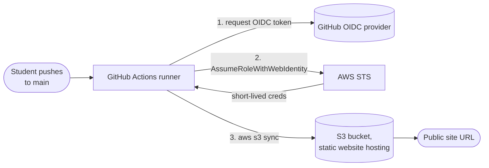

# CI/CD on AWS: one-session technical spec

Draft by davedat., 2026-09-13. For technical review before anything gets built.

## The time budget drives the design

45 to 60 minutes total, with 20 held back to help people who get stuck. That leaves **25 to 40 minutes of delivery**, and everything below follows from that number.

So the deploy target for this session is an S3 static site, and the reasoning is timing, not preference.

### What I want reviewed

1. The target swap. I argued against S3 two drafts ago because Event 1 already demos an S3 deploy by hand. I now think that is an advantage rather than a repeat, and the reasoning is below. Tell me if that is motivated thinking.
2. Whether 25 to 40 minutes of delivery is still too optimistic for the step list.
3. The OIDC provider collision, which is unchanged and still feels blunt.


### Why reusing S3 is now a feature

The pipeline is the entire lesson. The destination is incidental to it. Students saw an S3 deploy done by hand at Event 1, which means **zero minutes of this session go to explaining what the destination is.** Every minute goes to the pipeline. At 90 minutes that trade was not worth making. At 30 it is the difference between finishing and not.

The pattern being taught is identical on any target. A commit triggers a build, an artifact lands somewhere, something serves it. Swapping S3 for a container registry later changes the middle step and nothing else.


**The deciding number is the round-trip time.** An `aws s3 sync` workflow finishes in well under a minute, so students can push three times and watch it land three times. Repetition inside one session is what makes this stick. That is worth more than a better-sounding deploy target they see work once.

## Objective and non-goals

The attendee finishes able to explain and reproduce this: a commit triggers a build, the result gets published automatically, and no human credentials were involved.

Non-goals. Containers. Kubernetes. Multi-environment promotion. Writing IAM policies from scratch. Infrastructure as code as a topic, since students consume a template rather than write one.

## Architecture




## The student's path

Five steps. The club has already made steps 1 and 2 one-click.


| #   | Step                                                                           | Where                                 | Time                                   |
| --- | ------------------------------------------------------------------------------ | ------------------------------------- | -------------------------------------- |
| 1   | Fork the template repository                                                   | GitHub                                | 2 min                                  |
| 2   | Launch the CloudFormation stack with their GitHub username and repository name | AWS Console, one-click URL            | 3 min, stack creates in under a minute |
| 3   | Paste three stack outputs as repository secrets and variables                  | GitHub                                | 3 min                                  |
| 4   | Edit one line, commit, push                                                    | Their editor or the GitHub web editor | 2 min                                  |
| 5   | Watch the run, load the URL                                                    | Both tabs                             | 2 min                                  |


Roughly 12 minutes of mechanics, which is what leaves room to teach inside 25 to 40.

Let students use the GitHub web editor for step 4. A local clone adds git setup, credentials, and editor problems to a session with no slack in it. Anyone who wants to work locally can, but it is not the paved path.

## Session flow at 30 minutes of delivery

Scale the middle segments if the slot runs closer to 40.


| Time     | Segment                                   | Detail                                                                                                            |
| -------- | ----------------------------------------- | ----------------------------------------------------------------------------------------------------------------- |
| 0 to 4   | Deploy something by hand, badly           | Presenter uploads a file to S3 manually on screen, slowly. Then asks who wants to do that eleven more times today |
| 4 to 8   | Fork and launch the stack                 | Everyone clicks. The stack creates while the next segment runs                                                    |
| 8 to 14  | What just got created, and why it is safe | The OIDC exchange, drawn. This is the conceptual core and it runs on top of the stack wait                        |
| 14 to 18 | Wire the secrets, read the workflow       | Line by line. Nobody types it                                                                                     |
| 18 to 24 | Push and watch it land                    | The payoff. Then push a second time, because the loop is the lesson                                               |
| 24 to 28 | Break it on purpose                       | Remove `id-token: write`. Watch it fail. Read the actual error. Put it back                                       |
| 28 to 30 | Teardown and what is next                 | Delete the stack. Point at the container session                                                                  |
| +20      | Debug and help                            | Held back. See the failure table                                                                                  |


Doing the manual deploy first is deliberate. Automation only reads as relief to people who have felt the work being automated. Four minutes is enough for that.

Breaking it on purpose survives the cut at this length because it is four minutes and every attendee will meet a red X within a month. A student who has seen one deliberately is not frightened by an accidental one.

## Artifacts to build


### The repository

```
index.html          one heading the student edits
site/               what gets synced. index.html lives here
.github/workflows/deploy.yml
README.md           the five steps, so nobody depends on remembering the slides
```

Keep `site/` as the synced directory rather than the repository root. Syncing the root would publish `.github/` and `README.md` to a public bucket, which is a small thing that teaches a bad default.

### GitHub Actions workflow

```yaml
name: Deploy

on:
  push:
    branches: [main]

permissions:
  id-token: write   # lets this job request an OIDC token. Grants nothing else
  contents: read    # lets it check out the code

jobs:
  deploy:
    runs-on: ubuntu-latest
    steps:
      - uses: actions/checkout@v4

      - uses: aws-actions/configure-aws-credentials@v4
        with:
          role-to-assume: ${{ secrets.AWS_ROLE_ARN }}
          aws-region: ${{ vars.AWS_REGION }}

      - name: Publish
        run: aws s3 sync ./site "s3://${{ vars.BUCKET_NAME }}" --delete
```

Four steps, about fifteen lines, readable aloud in the four minutes budgeted for it.

Two details worth defending in review.

`id-token: write` is the line every student misreads. It sounds like write access to something. It only permits the job to request an identity token. Worth one slide on its own.

`--delete` makes the bucket mirror the directory, so a file deleted in git disappears from the site. It surprises people the first time and it is one sentence to explain.

Pin the action versions and confirm `configure-aws-credentials` is still on v4 the week of the event.

### CloudFormation template

The club builds this once. Each student launches their own stack, scoped to their own repository.

```yaml
AWSTemplateFormatVersion: '2010-09-09'
Description: Workshop stack. Public S3 site plus a GitHub OIDC deploy role.

Parameters:
  GitHubOwner:
    Type: String
    Description: Your GitHub username or org
  GitHubRepo:
    Type: String
    Description: Repository name, without the owner
  CreateOIDCProvider:
    Type: String
    AllowedValues: ['yes', 'no']
    Default: 'yes'
    Description: Choose no if this account already has a GitHub OIDC provider

Conditions:
  MakeProvider: !Equals [!Ref CreateOIDCProvider, 'yes']

Resources:

  GitHubOIDCProvider:
    Type: AWS::IAM::OIDCProvider
    Condition: MakeProvider
    Properties:
      Url: https://token.actions.githubusercontent.com
      ClientIdList: [sts.amazonaws.com]
      # ThumbprintList omitted on purpose. It is optional, and IAM retrieves
      # and uses the provider's intermediate CA thumbprint when it is absent.

  SiteBucket:
    Type: AWS::S3::Bucket
    Properties:
      BucketName: !Sub '${AWS::StackName}-${AWS::AccountId}'
      WebsiteConfiguration:
        IndexDocument: index.html
        ErrorDocument: index.html
      PublicAccessBlockConfiguration:
        BlockPublicAcls: true
        IgnorePublicAcls: true
        BlockPublicPolicy: false
        RestrictPublicBuckets: false
      OwnershipControls:
        Rules:
          - ObjectOwnership: BucketOwnerEnforced

  SiteBucketPolicy:
    Type: AWS::S3::BucketPolicy
    Properties:
      Bucket: !Ref SiteBucket
      PolicyDocument:
        Version: '2012-10-17'
        Statement:
          - Effect: Allow
            Principal: '*'
            Action: s3:GetObject
            Resource: !Sub '${SiteBucket.Arn}/*'

  GitHubActionsRole:
    Type: AWS::IAM::Role
    Properties:
      AssumeRolePolicyDocument:
        Version: '2012-10-17'
        Statement:
          - Effect: Allow
            Principal:
              Federated: !Sub 'arn:${AWS::Partition}:iam::${AWS::AccountId}:oidc-provider/token.actions.githubusercontent.com'
            Action: sts:AssumeRoleWithWebIdentity
            Condition:
              StringEquals:
                token.actions.githubusercontent.com:aud: sts.amazonaws.com
                token.actions.githubusercontent.com:sub: !Sub 'repo:${GitHubOwner}/${GitHubRepo}:ref:refs/heads/main'
      Policies:
        - PolicyName: publish-to-one-bucket
          PolicyDocument:
            Version: '2012-10-17'
            Statement:
              - Effect: Allow
                Action: s3:ListBucket
                Resource: !GetAtt SiteBucket.Arn
              - Effect: Allow
                Action:
                  - s3:PutObject
                  - s3:DeleteObject
                Resource: !Sub '${SiteBucket.Arn}/*'

Outputs:
  RoleArn:
    Description: Paste as repository secret AWS_ROLE_ARN
    Value: !GetAtt GitHubActionsRole.Arn
  BucketName:
    Description: Paste as repository variable BUCKET_NAME
    Value: !Ref SiteBucket
  Region:
    Description: Paste as repository variable AWS_REGION
    Value: !Ref AWS::Region
  SiteUrl:
    Description: Your live site
    Value: !GetAtt SiteBucket.WebsiteURL
```

Three things in here that a reviewer should push on.

The bucket is public, and public buckets are the thing every security guide tells you to avoid. It is correct for a static site and wrong almost everywhere else, and that distinction is worth thirty seconds out loud rather than skipping past it. `BlockPublicAcls` and `IgnorePublicAcls` stay on, so the bucket is reachable only through the policy and never through per-object ACLs. `BucketOwnerEnforced` disables ACLs altogether.

The S3 website endpoint serves HTTP, not HTTPS. Getting HTTPS means CloudFront, and a distribution takes long enough to create that it does not fit this session. Say that out loud rather than letting someone notice the missing padlock and assume it was an oversight.

IAM enforces something worth knowing. When the GitHub OIDC provider is the trusted principal, IAM checks at policy creation time that `token.actions.githubusercontent.com:sub` is present and is not only a wildcard. A trust policy without it is rejected outright. Scoping to one repository and one branch is therefore not merely good practice, it is the only thing that will deploy.

## Open technical decisions


### 1. The OIDC provider collision

`AWS::IAM::OIDCProvider` for `token.actions.githubusercontent.com` is one per account. A student who has done this before, or who runs the stack twice, gets a create failure. The `CreateOIDCProvider` parameter puts the burden on the student to know which case they are in, which is exactly the kind of thing that costs five minutes of the debug window.

Options I considered. A separate bootstrap stack, which adds a step to a session with no slack. A custom resource that checks first, which puts Lambda into a beginner workshop. Pre-creating it, which does not work because these are the students' own accounts.

**Open question: cleaner pattern, or is a well-labelled parameter good enough?**

### 2. Bucket naming collisions

`${AWS::StackName}-${AWS::AccountId}` is globally unique in practice because the account ID is in it. Worth a check that nothing else in the template assumes a predictable name.

### 3. Whether the second push is worth the time

The flow has students push twice, at minutes 18 to 24. The second push costs about two minutes and teaches that the loop is a loop rather than a one-off trick. I think it is the highest-value two minutes in the session. It is also the first thing to cut if the room is running behind.

## Failure modes, and the 20-minute debug window

The 20 minutes held back is the design's shock absorber. It is also the reason this target was chosen: an S3 sync fails fast and fails legibly, so a stuck student gets a readable error in under a minute rather than waiting on a deployment that may still be rolling.

Written for the helper handout, in expected order of frequency.


| Symptom                                                   | Cause                                                                                                             | Fix                                                  |
| --------------------------------------------------------- | ----------------------------------------------------------------------------------------------------------------- | ---------------------------------------------------- |
| `Not authorized to perform sts:AssumeRoleWithWebIdentity` | The `sub` condition does not match. Usually a branch other than `main`, or a typo in the username at stack launch | Check the branch, then the stack parameter           |
| `Credentials could not be loaded`                         | `permissions: id-token: write` missing or edited out                                                              | Restore it                                           |
| Workflow is green, the site is unchanged                  | Browser cache, or they edited the root `index.html` instead of `site/index.html`                                  | Hard refresh, then check the path                    |
| `AccessDenied` on `s3 sync`                               | The role policy covers the bucket but not its objects, or the wrong bucket name was pasted                        | Compare the pasted variable against the stack output |
| Site returns 403                                          | The bucket policy did not attach, or public access block is still on                                              | Check the stack completed, not just started          |
| Stack create fails on the OIDC provider                   | The account already has one                                                                                       | Relaunch with `CreateOIDCProvider: no`               |
| Stack delete fails                                        | The bucket still has objects in it                                                                                | Empty the bucket, then retry                         |
| No padlock in the address bar                             | Expected. S3 website endpoints serve HTTP                                                                         | Explain, do not fix. HTTPS needs CloudFront          |


**Two or three floating helpers, minimum.** Beginners do not raise their hands. They stop clicking, fall behind, and decide the club is not for them. The helper's job is to notice the stopped clicking and go over unprompted.

**Print the table.** Helpers diagnosing from scratch in parallel is how a 20-minute window becomes 40.

## Cost

Effectively zero. An S3 bucket holding a few kilobytes with a handful of requests sits inside the always-free allowances. There is no compute, no load balancer, and nothing billed by the hour.

This is a second reason the timing constraint pushed the right way. The container version of this session needs a real cost slide, a billing alarm as a mandatory step, and a cleanup sweep the next day. This one needs teardown for tidiness, not to protect anybody's credits.

Delete the stack at the end anyway. It is two minutes, it leaves accounts clean, and it builds the habit before the session where it matters.

## Sources

- Create a role for OpenID Connect federation, [https://docs.aws.amazon.com/IAM/latest/UserGuide/id_roles_create_for-idp_oidc.html](https://docs.aws.amazon.com/IAM/latest/UserGuide/id_roles_create_for-idp_oidc.html)
- IAM and AWS STS condition context keys, [https://docs.aws.amazon.com/IAM/latest/UserGuide/reference_policies_iam-condition-keys.html](https://docs.aws.amazon.com/IAM/latest/UserGuide/reference_policies_iam-condition-keys.html)
- CfnOIDCProvider thumbprintList, [https://docs.aws.amazon.com/cdk/api/v2/docs/aws-cdk-lib.aws_iam.CfnOIDCProvider.html](https://docs.aws.amazon.com/cdk/api/v2/docs/aws-cdk-lib.aws_iam.CfnOIDCProvider.html)
- AWS::AppRunner::Service, for the sequel, [https://docs.aws.amazon.com/AWSCloudFormation/latest/TemplateReference/aws-resource-apprunner-service.md](https://docs.aws.amazon.com/AWSCloudFormation/latest/TemplateReference/aws-resource-apprunner-service.md)
- App Runner pricing, for the sequel, [https://aws.amazon.com/apprunner/pricing/](https://aws.amazon.com/apprunner/pricing/)

Checked 2026-09-13 through the AWS Knowledge MCP server. None of this has been run. It needs a dry run on a fresh AWS account and a fresh GitHub account before anyone teaches from it, and the dry run should time every step so the 25 to 40 minute claim is measured rather than assumed.