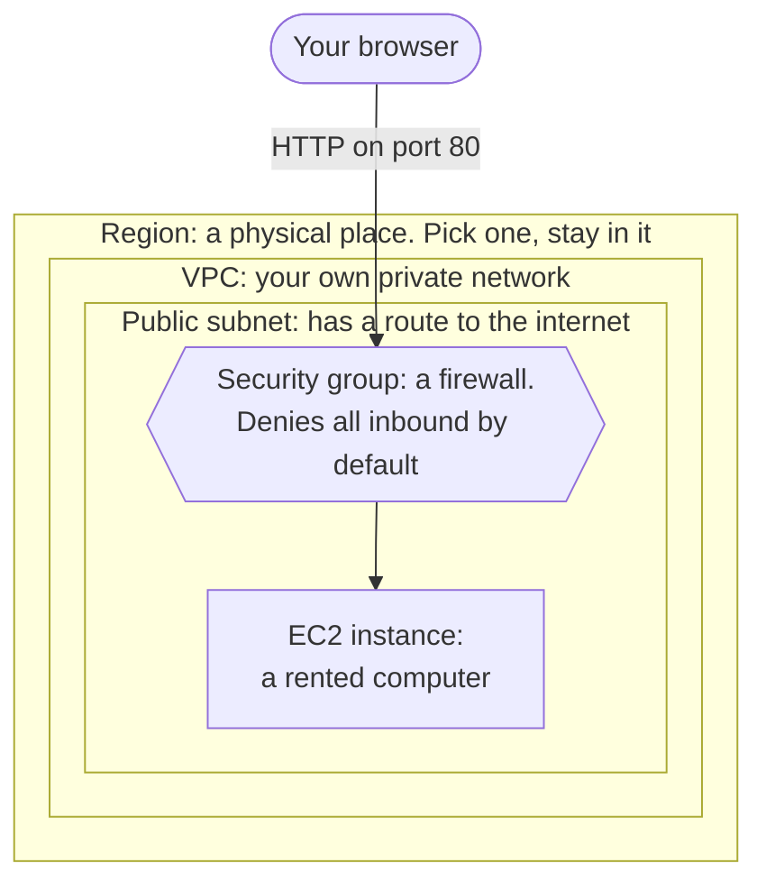

# Event 2, AWS 101 workshop: planning notes

Draft for Daksh, from davedat., 2026-09-13.

Notes only, as asked. The deck comes after this plan is approved.

These notes take positions rather than listing options, so there is something concrete to argue with. Anything marked "decision" needs a person to confirm it before the deck can start.

## The plan in one sentence

Every attendee launches a Linux server on EC2, opens it to the internet through a security group, loads a page from it in their own browser, then tears it down so nobody gets a bill.

## Why EC2 and not a second S3 deploy

Event 1 deploys a static site to S3 live on stage. If Event 2 has everyone repeat that same deploy, the one hands-on slot goes to something the room already watched. Anyone who came to Event 1 gets very little out of it.

EC2 works better for four reasons.

It is the service people mean when they say "a server", and it appears in more entry-level job postings than anything else on the list.

It forces the networking ideas to become real. You cannot reach your own instance until you understand why the port is closed.

It fails in useful ways. "I can't load the page" is almost always the security group, and that is the lesson.

It sets up everything after it. Load balancers, databases, and auto scaling all assume you know what an instance is.

The master plan lists EC2, S3, IAM, RDS, VPC, security groups, and an introduction to serverless. Nobody can do all of those hands-on in one session and we should not pretend otherwise. One thing gets built. The rest get a map.

## Running time

Decision: 90 minutes, not 60.

Event 1 runs 60 minutes and that is right for a talk. A workshop where thirty beginners each launch infrastructure needs the extra half hour. The padding is where people who fall behind catch up. A 60-minute version means either cutting the hands-on down to a demo, or finishing with half the room stuck.

If 90 minutes is impossible, cut scope instead of time. See the cut list near the end.

## The account problem, which needs solving first

This is the thing most likely to sink the event, and it has to be resolved before anything else gets built.

An AWS account requires a payment method at signup. A credit or debit card, with a $1 verification charge. Some students do not have one, and others will not put one into a signup flow for a club event. If the plan is that everyone makes an account on arrival, part of the room never gets past step one and spends the workshop watching.

Two things soften this and both belong in the pre-event email. A debit card works. And on the free plan the card is only ever charged if the student deliberately upgrades to a paid plan. That is not reassurance we invented, it is how the plan works. It still will not be enough for everyone.

| Option | Does it work | The problem |
|---|---|---|
| Everyone creates a personal AWS account beforehand | Best long term, they keep the account and its credits | Payment method required, and some will not do it in advance |
| AWS Academy Learner Lab sandbox accounts | No card, pre-budgeted, built for this | Provisioned through a faculty educator account, so we need a professor to host a classroom |
| Pre-created IAM users inside the club account | No friction on the day | Real money risk. Needs permission boundaries, a budget alarm, and cleanup afterwards |
| Club AWS credits | Does not solve it | Credits apply to an account that already exists. They do not remove the signup requirement |

Recommendation: ask everyone to create a personal account in advance through a pre-event email, and have a fallback ready for the people who cannot. The fallback is either Learner Lab, if a professor will host it, or a set of locked-down IAM users in the club account behind a hard budget alarm.

Action for Bilal: AWS Academy Learner Lab is provisioned through a faculty educator account, so the question is not whether Seneca is an Academy institution. The question is which professor holds an Academy educator account and will host a Learner Lab classroom for us. The master plan already lists professor outreach in the launch strategy, and this gives that outreach something concrete to ask for. The answer is needed before the pre-event email can be written.

## Pre-event email, sent a week ahead by Sep 30

Whatever gets decided above, attendees need something in their inbox before the day. Without it, the first twenty minutes of the workshop go to account signups.

The email should say:

- Create your AWS account now, with a step-by-step link. State plainly that a card is required, that a debit card works, that there is a $1 verification charge, and that nothing is billed on the free plan unless you choose to upgrade
- Choose the free plan, not the paid plan, at signup
- Bring a laptop, not a tablet or phone
- Sign in and confirm you can reach the AWS Console before you arrive
- Reply to this address if you get stuck or cannot make an account
- This takes about ten minutes, so it does not get postponed

Anyone who still cannot make an account pairs with someone who can. Nobody sits and watches.

## Session flow

| Time | Segment | What happens |
|---|---|---|
| 0 to 10 | Arrival and account check | Confirm everyone reaches the Console. Pair up anyone who cannot. This is the only time budgeted for it |
| 10 to 25 | The mental model | One diagram, drawn live rather than listed |
| 25 to 55 | Hands-on, launch the server | Everyone launches EC2, opens port 80, loads their own page |
| 55 to 65 | IAM, briefly | Why not to use root, and what a role is |
| 65 to 75 | The map of what we did not build | RDS, Lambda, load balancers, CloudFront, and where each one sits |
| 75 to 85 | Cost and teardown | Terminate everything. Then what the free plan actually covers |
| 85 to 90 | Cert path and what is next | Cloud Practitioner, the next event, Discord |

### The mental model, 10 to 25

Build one diagram live, piece by piece. Do not show the finished version first.



A region is a physical place. Pick one and stay in it all session. Half of all "my instance disappeared" confusion comes from switching regions.

A VPC is your own private slice of the network. Every account gets a default one, which is why this works without configuring anything.

A subnet is a section of that network. Public means it has a route to the internet.

An instance is a rented computer inside the subnet.

A security group is a firewall around the instance, and it denies everything inbound by default. The whole workshop turns on this line. Say it slowly, and say it before anyone gets stuck on it rather than after.

Leave the diagram on screen for the rest of the session. Point at it for everything that follows.

### Hands-on, 25 to 55, about seven clicks

Target end state: the attendee types their instance's public IP into a browser and sees a page they control.

1. EC2, then Launch instance
2. Name it something personal, so twenty identical instances stay distinguishable on a shared screen
3. Amazon Linux 2023, and whichever of `t2.micro` or `t3.micro` is free-tier eligible in the chosen region
4. Key pair: create one and download it. It is only needed for the optional SSH stretch goal
5. Network settings: allow HTTP from anywhere. This is the security group. Stop here and explain what just happened
6. Advanced, then User data: paste the script below
7. Launch. Wait for the status checks. Copy the public IPv4 address. Open it in a browser

The user data script is the choice that makes this workshop survivable:

```bash
#!/bin/bash
dnf install -y nginx
echo "<h1>Hello from YOUR-NAME's EC2 instance</h1>" > /usr/share/nginx/html/index.html
systemctl enable --now nginx
```

Everything runs at boot, so the main path needs no SSH at all. SSH with thirty beginners means key permission errors, Windows path problems, PuTTY, and `Permission denied (publickey)`. That is twenty minutes of the session spent on its least interesting part. Make SSH the stretch goal for whoever finishes early.

Failure modes to have answers ready for, in the order they will happen:

| Symptom | Cause |
|---|---|
| The page will not load | The security group is missing its HTTP rule. This will be most of them |
| The page will not load and the security group looks right | They are using the private IP instead of the public one |
| "I don't see my instance" | Wrong region in the top-right dropdown |
| The page loads blank, or shows the nginx default | A typo in the user data, or it is still booting. Give it another minute |
| The browser forces HTTPS | Type `http://` explicitly. Some browsers hide this and it looks like a dead server |

Write these on a one-page handout so helpers do not each diagnose from scratch.

### IAM, 55 to 65, concept only

No hands-on. Ten minutes, two ideas.

Root is the account owner and you should almost never use it. Create a user, turn on MFA, and use that. Say what happens when a root key leaks, because it is the most common way a student project turns into a five-figure bill.

A role is a set of permissions that something assumes, not a login. Your instance gets a role so it can talk to S3 without storing a password. This idea makes the rest of AWS make sense.

Skip policies, JSON, and evaluation order. That is a session of its own, and the master plan already lists "how does IAM actually evaluate permissions" as a monthly online topic.

### The map, 65 to 75

Point at the same diagram and add the boxes nobody built.

RDS is a managed database. Same VPC, different subnet, never open to the internet.

Lambda runs code with no instance at all. State the tradeoff plainly, that you give up control in exchange for having no server to manage.

A load balancer is what sits in front once there is more than one instance. This is the bridge into the system design event.

CloudFront keeps cached copies near the user.

Ten minutes, no depth. The goal is that every service name they hear for the rest of the year has somewhere to land.

### Cost and teardown, 75 to 85, do not cut this

Everyone terminates their instance before leaving. Walk it on screen. EC2, then Instances, then select, then Instance state, then Terminate. Confirm out loud that the room has done it.

Get the free tier story right, because it changed and the old version is still what most people repeat. AWS no longer runs the twelve-months-free model. A new account today signs up on either a free plan or a paid plan.

The free plan gives $100 in credits at signup and up to $100 more for exploring core services, so $200 at most. Nothing is charged unless the student deliberately upgrades. The account closes six months after opening, or when the credits run out, whichever comes first. The credits themselves expire twelve months after the account is created.

The paid plan is normal pay-as-you-go from day one.

Separately, more than thirty services stay free within monthly limits on both plans.

Do not tell the room it is free for a year. It is not, and someone will build on that assumption.

What this means for the workshop is good news and worth saying out loud. On the free plan a forgotten instance cannot produce a surprise bill. What it can do is quietly burn the credits the student was going to spend on their own projects, and the account expires at six months either way. So teardown protects their own runway rather than preventing a charge.

Check this against [aws.amazon.com/free](https://aws.amazon.com/free/) the week of the event. AWS changed this model recently and could change it again. The presenter should not rely on notes written in September.

A real bill is only possible for someone who signed up on the paid plan, or who already had an AWS account and has spent past their credits. Say that, and tell them to set a billing alarm.

### Close, 85 to 90

AWS Certified Cloud Practitioner: what it is, roughly what it costs, and that the club is treating it as a group goal across the year. The master plan is explicit that certifications run as a thread through the year and get introduced properly here. Then the Discord.

End on a live CI/CD demo rather than a slide. Presenter only, nobody follows along, about two minutes.

> "Watch this. I'm changing one line in this file. I'm pushing it. I'm not touching AWS at all." Switch to the GitHub Actions tab, wait for it, refresh the site. "That's what we're doing next event."

This needs no preparation beyond a pipeline the presenter already has working. It ends the workshop on something better than a certification slide, and it advertises Event 3 to the people most likely to come. See the CI/CD proposal (removed 2026-09-24, in git history: `events/cicd-track/` in commit `df72b74`).

## Helpers

A workshop with one presenter and no floaters strands anyone who gets stuck. With thirty people, expect five or six to hit the same problem at the same moment and none of them to raise a hand.

Ask for two or three helpers. Their job is to watch for people who have stopped clicking and go to them unprompted. Beginners do not ask for help. They fall behind quietly and decide the club is not for them.

Decision: is Event 2 in person or online? The SSF three-week rule that forced Event 1 online does not apply by October, so in person is possible. This changes the helper model completely.

In person, helpers walk the room, glance at screens, and catch problems in seconds. This is much better for a workshop.

Online, helpers need breakout rooms and attendees need to be told upfront to share their screen when stuck. It works, but the failure rate goes up and stuck people become invisible.

Run it in person if the room can be booked. A workshop is the event type that loses the most over a video call.

## What to cut if time runs short

In order, first to go:

1. The SSH stretch goal, which is already optional
2. The map segment, trimmed to three services named in two minutes
3. IAM, compressed to the one sentence about not using root
4. The certification close, moved to the Discord. Keep the CI/CD demo, which takes two minutes and sells the next event

Never cut the hands-on or the teardown. If both cannot fit, the event is scoped wrong and should lose a concept rather than a step.

## Open questions for Daksh and Bilal

1. In person or online? This drives room booking, the helper model, and the SSF filing deadline.
2. Is 90 minutes approved?
3. How do attendees get AWS accounts? This needs the Learner Lab answer from Bilal, specifically whether a professor will host a classroom, before the pre-event email can go out.
4. Who presents, and who floats? Two or three helpers minimum.
5. What headcount should we expect? Event 1 attendance is the best signal available and we will have it on Sep 16.
6. What is the real SSF filing lead time? Oct 7 is three weeks out and the filing cannot be the thing that slips.

## Dates working backwards from Oct 7

| What | When |
|---|---|
| These notes reviewed and approved | Week of Sep 15 |
| Account strategy resolved | Sep 19 |
| Format locked, SSF filing submitted | Week of Sep 22 |
| Meetup listing published | Sep 26 |
| Slides built from this plan | Sep 29 |
| Pre-event email to registrants | Sep 30 |
| Marketing posts live | Sep 30 |
| Dry run on a fresh AWS account | Oct 5 |

The dry run matters more than it sounds. Running the flow on an account that already has a VPC configured, a key pair saved, and a browser signed in tells you nothing about what a first-timer hits.

## One note outside the workshop

Daksh and I hit the same thing on Sep 13. Everything lives in Discord, mixed in with ordinary conversation, and it is hard to track what is assigned to whom. Daksh said we should have had a Notion or Linear board.

I have started a set of tracking documents because of that, covering what was decided and when, and who currently owes what. Happy to share them and walk through them at the next weekly meeting. Worth sorting out before Events 3 and 4, because the problem compounds.

## Sources checked

- AWS Free Tier, https://aws.amazon.com/free/
- AWS Free Tier FAQs, https://aws.amazon.com/free/free-tier-faqs/
- Why the AWS Free Tier requires a payment method, https://aws.amazon.com/premiumsupport/knowledge-center/free-tier-payment-method/
- Choosing a plan, AWS Billing, https://docs.aws.amazon.com/awsaccountbilling/latest/aboutv2/free-tier-plans.html

Checked 2026-09-13. Re-check the week of the event.
