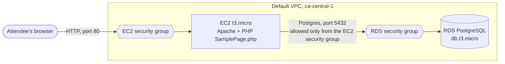
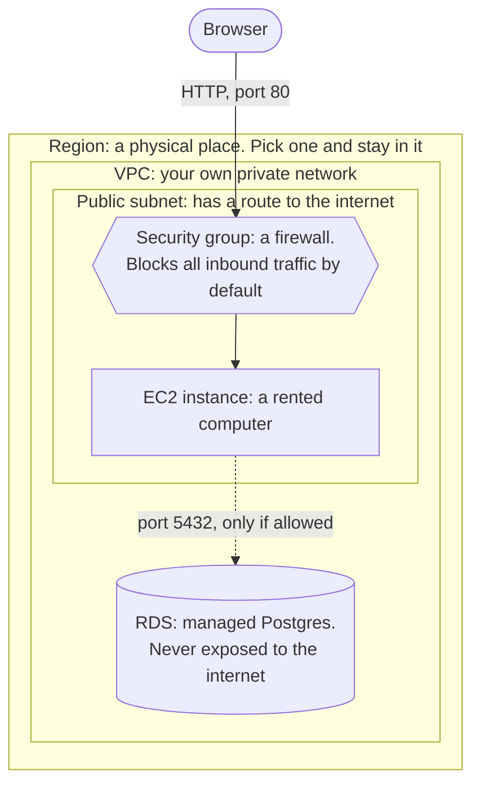

# Event 2: AWS 101 Workshop, Runbook v2

AWS Student Builder Group @ Seneca Polytechnic · Wednesday, October 7, 2026 · Draft v2, 2026-09-18

This is an expanded version of the first Event 2 runbook. It keeps that draft's shape (seven phases, a team challenge, a prize) and adds the parts a room of thirty beginners needs to actually succeed: how people get accounts, a deploy path that does not depend on SSH, a failure-mode sheet for helpers, a teardown, and corrected AWS facts. Section 2 lists every change and why.

---

## 1. The workshop on one page

**Goal.** Every attendee leaves having launched a real server on AWS, loaded a page from it in their own browser, and torn it down. Teams then extend it with add-ons, including connecting it to a database.

**Format.** In person, hands-on, 90 minutes. Laptops required.

**Audience.** Mostly first- and second-year students. Many will be opening the AWS Console for the first time.

**What gets built.**

Everyone builds all of it in the guided section, following AWS's official tutorial. The team challenge extends it.

**Timeline.**

| Phase | Time | What happens |
|---|---|---|
| 0. Arrival and account check | 0 to 10 | Everyone reaches the Console. Anyone who cannot gets paired up |
| 1. Framing | 10 to 12 | Why today is hands-on |
| 2. Five categories | 12 to 22 | Compute, storage, identity, databases, serverless. The map, not the detail |
| 3. Architecture decisions | 22 to 30 | One scenario, one diagram, built live |
| 4. Guided build: the official AWS tutorial | 30 to 62 | Everyone follows AWS's web server and RDS tutorial in the Console: EC2, RDS, Apache and PHP, the sample page |
| 6. Team challenge | 62 to 78 | Teams of 2 or 3 work through add-ons |
| 7. Teardown | 78 to 85 | Everyone terminates and deletes everything, on screen, together |
| 8. Close | 85 to 90 | Winners, certification path, next event |

**Cost.** Everything runs on the student's own AWS free-plan credits. Thirty `t3.micro` instances and about ten `db.t3.micro` databases for roughly two hours costs cents per attendee in credits. Nobody on the free plan can be charged money. Section 11 has the detail.

---

## 2. What changed from the first draft, and why

| # | First draft said | This version says | Why |
|---|---|---|---|
| 1 | Instance type `t2.micro` | `t3.micro` | Accounts created on or after 2025-07-15 are on the new free plan, whose eligible types are `t3.micro`, `t3.small`, `t4g.micro`, `t4g.small`, `c7i-flex.large`, `m7i-flex.large`. `t2.micro` is not on that list, and every student account will be new |
| 2 | "Set up an AWS Free Tier account" | "Create an AWS account on the free plan" | The twelve-month free tier was replaced by a credits model: $100 at signup, up to $100 more, account closes after six months or when credits run out. Telling a room "free for a year" is now wrong |
| 3 | "Without IAM, any service can talk to any other" | AWS denies by default. IAM decides who can call which AWS API | The original is inverted. Nothing talks to anything until you allow it |
| 4 | "Connecting EC2 to RDS is an IAM decision" | It is a security group decision | Whether EC2 can reach RDS on port 5432 is network access, controlled by security groups. The console's own "connect EC2 to RDS" feature works by editing security groups. IAM controls API calls, not packets |
| 5 | Add-on: wire the database so form submissions save, with no backend provided | Same add-on, with a ready-made sign-up API and a one-command setup script in the public repo | Static HTML can't talk to a database. Shipping a small API (Node, about 100 lines) keeps the original add-on and makes it doable in 20 minutes. It still teaches the real lesson: if the database is unreachable, fix the security group |
| 6 | Add-on: custom domain with Route 53 | Add-on: give the instance an IAM role and read from S3 | A domain costs money, a hosted zone costs $0.50 a month, DNS can take longer than the challenge, and the public IP dies at teardown. The IAM role add-on is free and makes IAM concrete |
| 7 | No teardown | A dedicated seven-minute teardown phase | Thirty instances and ten databases left running quietly burn students' credits. This phase is never cut |
| 8 | Install Apache over SSH, upload the file with `nano` or `wget` | Install Apache and PHP over EC2 Instance Connect, as the official tutorial does | Browser-based Instance Connect avoids key files and SSH clients, the step where beginners usually fall behind |
| 9 | RDS "pre-created" in the checklist but "created live, 3 to 5 min" in Phase 5 | One person per team creates their own database in Phase 5 so it is ready for the challenge | Removes the contradiction and gives teams a database to use. Creation typically takes 5 to 10 minutes, which overlaps with the walkthrough |
| 10 | No time budgeted for account problems | 10 minutes at the start | The single most likely way this event fails is people who cannot sign in |
| 11 | "Lambda isn't for a persistent web server" | "We use EC2 because it makes the networking visible. Lambda hides it" | Lambda with API Gateway or a function URL serves web apps well. The honest reason for EC2 today is teaching value |
| 12 | Next event named as System Design × AWS | "The next event" | The Oct 28 topic is not decided yet |
| 13 | No certification mention | Cloud Practitioner path in the close | The club's annual plan introduces it at this event |
| 14 | A homemade HTML page with a sign-up form | AWS's official tutorial, [Create a web server and an Amazon RDS DB instance](https://docs.aws.amazon.com/AmazonRDS/latest/UserGuide/TUT_WebAppWithRDS.html), and its `SamplePage.php` | Same idea as the first draft (a form on EC2 that saves to RDS), but attendees learn the real product and AWS's own docs, not our material. The form saving to the database is now the main path, not a hard add-on |

---

## 3. Decisions needed before building slides

| Decision | Recommendation | Who decides | Needed by |
|---|---|---|---|
| In person or online | In person. A workshop loses the most over video, and the rule that forced Event 1 online no longer applies in October | Club president, event lead | Week of Sep 22, for the event filing |
| 90 minutes | Yes. Cut scope, not time (Section 13) | Event lead | Now |
| How attendees get accounts | Personal free-plan accounts made in advance, with a fallback (Section 4) | Club president | Sep 26, before the pre-event email |
| Region | `ca-central-1` (Canada Central, Montreal). Close, and everything we use is available there | Presenter | Before the dry run |
| Who presents, who helps | One presenter, three helpers minimum | Event lead | Week of Sep 28 |
| Prize | Anything real and confirmed. Do not announce "merch coming soon" on the day | Club president | Oct 2 |

---

## 4. Accounts: the blocker to solve first

An AWS account requires a payment method at signup: a credit or debit card, with a small temporary verification charge. Some students do not have a card, and some will not enter one for a club event. If the plan is "everyone signs up on arrival," part of the room spends the event watching.

Two facts help, and both go in the pre-event email. A debit card works. And on the free plan, the card is never charged unless the student chooses to upgrade to the paid plan.

| Option | Works? | Catch |
|---|---|---|
| Personal free-plan account made before the event | Best. They keep the account and its credits | Needs a card, and some people will not do it in advance |
| AWS Academy Learner Lab sandbox | No card, pre-budgeted, built for teaching | Provisioned by a faculty member with an AWS Academy educator account. We need a professor willing to host a classroom |
| Locked-down IAM users in the club's AWS account | No friction on the day | This is the only option that risks real money. Needs a permissions boundary, a budget alarm, and cleanup afterwards |
| Club AWS credits | Does not solve this | Credits are applied to an account that already exists |

**Plan.** Personal accounts made in advance. Fallback, in order: Learner Lab if a professor agrees, otherwise locked-down club IAM users behind a hard budget alarm. Anyone still without access pairs with a teammate who has it. Nobody sits and watches.

---

## 5. Before the event

### Pre-event email, sent by Sep 30

- Create your AWS account now. A card is required. A debit card works. There is a small verification charge. Nothing is billed on the free plan unless you choose to upgrade
- Pick the **free plan** at signup, not the paid plan
- Sign in once and confirm you can see the AWS Console
- Bring a laptop. A tablet or phone will not work
- Reply to this email if you get stuck or cannot make an account
- About ten minutes of setup. Do it now, not the morning of

Repeat as a Discord reminder 48 hours out and on the day.

### What attendees build

AWS's official tutorial, [Create a web server and an Amazon RDS DB instance](https://docs.aws.amazon.com/AmazonRDS/latest/UserGuide/TUT_WebAppWithRDS.html), PostgreSQL version. Nothing homemade to host. The companion page at https://aws-seneca.github.io/aws-101-official-tutorial/ links each part of the tutorial and lists where the day differs from it (Phase 4).

### Room and equipment

- Arrive 30 minutes early
- Projector connected. Presenter laptop signed in to the Console, region set to `ca-central-1`, font size raised
- A finished example instance and database already running on the presenter account, as a backup if the live walkthrough stalls
- Wi-Fi tested with 30 devices in mind. Know the fallback (hotspot, wired)
- Helper handout printed (Section 10)
- Challenge sheet printed or linked (Section 8)
- Food out before people arrive

### Checklist

- [ ] Account strategy confirmed and pre-event email sent (Sep 30)
- [ ] Official tutorial walked end to end on a **brand-new account**, with the day's five changes
- [ ] Presenter account: backup instance and database running, region set
- [ ] Helpers briefed on the handout and their section of the room
- [ ] Challenge sheet ready
- [ ] Prize confirmed
- [ ] Free-plan facts re-checked against aws.amazon.com/free the week of the event

---

## 6. Session plan, phase by phase

### Phase 0: Arrival and account check (0 to 10)

Everyone signs in to the Console and sets the region to **Canada (Central)**. Helpers walk the room and check screens. Anyone who cannot sign in gets paired now, not in minute 35.

Say it once, clearly: *"Top right corner, the region should say Canada (Central). If your stuff ever 'disappears' today, check this first."*

### Phase 1: Framing (10 to 12)

One line back to Event 1: *"Last time you watched a deploy. Today you do one."*

Then the shape of the session: a quick map of the services, one design decision, then everyone builds. Laptops open.

### Phase 2: The five categories (12 to 22)

The goal is a map, not comprehension. They fill it in during the build.

**Compute: EC2.** A virtual server you rent. You choose the operating system, what is installed, and what ports are open. Pick it when you need full control or a long-running process.

**Storage: S3.** Object storage reachable over the internet, not tied to any one server. *"This is what we deployed to at the kickoff. Today we use EC2 instead. Different tool, different reason."*

**Identity: IAM.** Who is allowed to do what. Every AWS API call is checked against IAM, and the default answer is no. Two ideas only:
- Do not use the root account day to day. Make a user, turn on MFA
- A **role** is a set of permissions a service takes on, not a login. An instance with a role can read from S3 without anyone storing a password on it

**Databases: RDS.** A managed relational database. AWS handles the server, patching, and backups. You connect and use it. We use PostgreSQL because it is open source and everywhere.

**Serverless: Lambda.** Run a function without managing a server. You pay per request. Preview only, it gets its own session later in the year.

### Phase 3: Architecture decisions (22 to 30)

Frame: *"Given a problem, how do you pick the service?"*

Scenario: *"You're building a site where people sign up. What do you need?"* Build the diagram live, one box at a time. Do not show the finished version first.

- A server to handle requests: **EC2**
- Somewhere to keep user data: **RDS**
- Something to control who can reach what: **security groups** for network traffic, **IAM** for AWS permissions
- Somewhere for images and files: **S3**

On Lambda: *"We could build this with Lambda too, and plenty of real sites are. We're using EC2 today because it makes the networking visible. You'll see every port you open. Lambda hides that, which is great in production and bad for learning."*

The line to say slowly, before anyone gets stuck: **"A security group blocks everything inbound until you allow it."** Most problems today will come back to this sentence.

Leave the diagram on screen for the rest of the session and point at it.

### Phase 4: Guided build, the official AWS tutorial (30 to 62)

Everyone follows AWS's own tutorial in the real Console, [Create a web server and an Amazon RDS DB instance](https://docs.aws.amazon.com/AmazonRDS/latest/UserGuide/TUT_WebAppWithRDS.html), taking the **PostgreSQL** tab wherever there is one. The presenter drives it on screen, one part at a time. The point is that attendees learn the real product and AWS's documentation, which is what they will use on their own afterwards.

| Part | Time | What happens |
|---|---|---|
| [1. Launch an EC2 instance](https://docs.aws.amazon.com/AmazonRDS/latest/UserGuide/CHAP_Tutorials.WebServerDB.LaunchEC2.html) | 30 to 40 | Amazon Linux 2023, security group with SSH, HTTP and HTTPS |
| [2. Create an RDS DB instance](https://docs.aws.amazon.com/AmazonRDS/latest/UserGuide/CHAP_Tutorials.WebServerDB.CreateDBInstance.html) | 40 to 46 | PostgreSQL, Free tier template, *Connect to an EC2 compute resource*, initial database `sample`. It takes several minutes to become available, so start it early |
| [3. Install a web server](https://docs.aws.amazon.com/AmazonRDS/latest/UserGuide/CHAP_Tutorials.WebServerDB.CreateWebServer.html) | 46 to 62 | Connect with EC2 Instance Connect, install Apache and PHP while the database finishes, write `dbinfo.inc` and `SamplePage.php`, add a row through the page |

**Where the day differs from the tutorial.** Say these before each part and keep them on screen:

| Step | Tutorial says | Today | Why |
|---|---|---|---|
| Region | Any | Canada (Central), `ca-central-1` | Helpers can find everyone's resources |
| Instance type | `t2.micro` | `t3.micro` | `t2.micro` is not free-plan eligible for accounts created on or after 2025-07-15 |
| Key pair and SSH | Key pair, SSH from My IP | No key pair, SSH from anywhere | EC2 Instance Connect in the browser needs port 22 open to AWS's service, which My IP blocks. Acceptable for 90 minutes; say that production would restrict it |
| Database engine | MariaDB, MySQL or PostgreSQL | PostgreSQL | One engine for the room |
| Master password | Any | Letters and numbers only | Spaces and quotes break the PHP connection string |

**Moments to narrate:**
- Network settings in Part 1: *"These ticks create a security group. A security group blocks everything inbound until you allow it."*
- Connectivity in Part 2: *"Connect to an EC2 compute resource creates a pair of security groups so your server, and only your server, can reach the database on port 5432. That's networking, not IAM."*
- The first row saved in Part 3: *"That row went from your browser, to your server, to a managed database, across two security groups."*

**Done when:** `http://<public IP>/SamplePage.php` saves a name and address and lists it.

### Phase 6: Team challenge (62 to 78)

Teams of 2 or 3. Everyone already has a live site from Phase 4.

The add-on sheet is in Section 8. Exec team:

- Walk the room. Go to anyone who has stopped clicking, without waiting for a hand. Beginners do not ask for help, they quietly decide the club is not for them
- If someone is fully lost, fold them into a stronger team
- 5-minute warning at 73, time called at 78

### Phase 7: Teardown (78 to 85). Never cut this

Everyone does it together, on screen. Do not move to prizes until the room confirms.

1. **EC2 → Instances →** select your instance **→ Instance state → Terminate**
2. **RDS → Databases →** select **→ Actions → Delete**. Untick *Create final snapshot*, untick *Retain automated backups*, tick the acknowledgement, type `delete me`
3. If you did add-on 4: delete the S3 bucket's objects, then the bucket
4. Refresh both pages. Terminated or deleting is correct

Say why: *"On the free plan nothing here can charge your card. But a forgotten instance and database quietly burn the credits you'd rather spend on your own projects."*

### Phase 8: Close (85 to 90)

- Announce winners. Recognize effort, not only the winners
- **AWS Certified Cloud Practitioner:** what it is, that it is the usual first certification, and that the club is treating it as a group goal this year
- Next event date. Add it to your calendar now
- Discord for help, questions, and posting what you built

Optional, two minutes, presenter only: change one line in a repository, push, and let a pipeline redeploy a site with nobody touching AWS. It is a strong teaser if the next event ends up being CI/CD.

---

## 7. Presenter's cheat sheet

| Moment | Say |
|---|---|
| Region | "Top right, Canada (Central). If something disappears, check this first" |
| Security group | "It blocks everything inbound until you allow it" |
| Tutorial | "Keep AWS's tutorial open. That's what you'll use on your own next time" |
| Page is live | "Anyone in the world can open that URL right now" |
| RDS connectivity | "This is networking, not IAM. Security groups decide who can reach the database" |
| Root account | "Don't use it day to day. Make a user, turn on MFA" |
| Teardown | "Nothing charges your card on the free plan. It burns your credits instead" |

---

## 8. Challenge sheet

Points, not a race. Everything happens in the real Console and on the instance.

| Add-on | Points | Done when |
|---|---|---|
| **Make the page yours.** Edit `SamplePage.php`: a title, team name, some CSS | 1 | A helper sees it, and the old rows are still there because they live in RDS |
| **Add a second page.** `about.php` or `.html` in `/var/www/html`, linked from the sample page | 1 | Both load from the public IP |
| **Read the security groups.** Find the rule that lets the server reach the database on 5432, and explain why a laptop can't | 2 | A helper hears a correct explanation |
| **Query the database yourself.** `psql` from the instance, `SELECT` the rows added through the page ([AWS docs](https://docs.aws.amazon.com/AmazonRDS/latest/UserGuide/USER_ConnectToPostgreSQLInstance.psql.html)) | 2 | The rows show in the terminal |
| **Give the instance a role.** S3 bucket, IAM role on the instance, read a file with the AWS CLI and no keys ([AWS docs](https://docs.aws.amazon.com/AWSEC2/latest/UserGuide/iam-roles-for-amazon-ec2.html)) | 2 | `aws s3 cp` works from the instance |

Tiebreaker: the exec team judges quality. Winners are recognized on the club's Discord and socials, with their permission.

---

## 9. Roles on the day

| Role | Count | Job |
|---|---|---|
| Presenter | 1 | Drives the screen, narrates every click, keeps time |
| Helpers | 3 or more, one per section of the room | Watch for stuck screens and go to them. Use the handout. Check the region first, always |
| Timekeeper | 1, can be a helper | Signals at 50, 58, 73, 78, 85 |
| Photographer | 1, can be a helper | Candid shots of people on laptops, with consent, for the recap |

---

## 10. Helper handout: what breaks and what to do

In the order it will happen.

| Symptom | Fix |
|---|---|
| No account, or can't sign in | Pair with a teammate now |
| "My instance disappeared" | Wrong region. Top right → Canada (Central) |
| `t3.micro` not marked free tier eligible | Check the region. Older accounts are on the legacy free tier; it still works and costs cents |
| Public IP won't load | Use `http://` and the public IPv4. Then check the security group's HTTP rule |
| EC2 Instance Connect fails | SSH rule set to My IP, or still starting. Allow SSH from anywhere, wait for 2/2 checks |
| `dnf` can't find `php-pgsql` or `postgresql15` | Not Amazon Linux 2023. Check `cat /etc/system-release`, relaunch |
| "Failed to connect to PostgreSQL" | Check endpoint (no port), user, password and database `sample` in `/var/www/inc/dbinfo.inc`. Then the RDS security group's 5432 rule |
| Page shows PHP source | `sudo systemctl restart httpd` |

---

## 11. Cost and account model

Verified 2026-09-18 against AWS documentation. Re-check aws.amazon.com/free the week of the event.

- New accounts (created on or after 2025-07-15) pick a **free plan** or a **paid plan**
- Free plan: $100 in credits at signup, and up to $100 more for trying core services, so $200 at most. Nothing is charged unless the student upgrades. The account closes six months after it is opened or when the credits run out, whichever comes first
- Paid plan: normal pay-as-you-go, with the same credits
- Free-plan eligible here: EC2 `t3.micro` and `t4g.micro` (among others), RDS PostgreSQL on `db.t3.micro` or `db.t4g.micro`, Single-AZ only

**Blast radius.** One `t3.micro` with a public IPv4 address, and one database per team, for about two hours, is a small fraction of a dollar in credits per attendee. Confirm with the AWS Pricing Calculator before quoting a number to the room.

**Where real money is possible.** Only for someone on the paid plan who has spent past their credits, someone with an older account outside the free tier, or the club account if we use the IAM-user fallback. Tell the room to set a billing alarm, and set one on the club account before the event.

**Do not say "free for a year."** That was the old model. Someone will plan around it.

---

## 12. After the event, within 24 hours

**Community.** Recap post: how many people deployed, who won, a photo. Share the winning team's work if they agree. Post the next event date.

**Exec debrief.**
- Where did people get stuck in the guided build? Fix the steps
- Did the database finish creating in time for the challenge?
- Was the challenge too hard, too easy, or right?
- Did everyone tear down? Worth a Discord reminder the next day regardless

---

## 13. If time runs short

Cut in this order:

1. The optional pipeline teaser at the close
2. Phase 2 trimmed to three services in five minutes
3. Add-on 4 dropped from the challenge
4. Phase 5 done as a presenter demo only, with add-on 1 removed

**Never cut the guided build or the teardown.** If both do not fit, the session is scoped wrong. Drop a concept, not a step.

---

## 14. Dates, working back from Oct 7

| What | When |
|---|---|
| This runbook reviewed | Week of Sep 21 |
| Format locked, event filed | Week of Sep 22 |
| Account strategy decided | Sep 26 |
| Meetup listing published | Sep 26 |
| Official tutorial walked on a fresh account, companion page checked | Sep 28 |
| Slides built from this runbook | Sep 29 |
| Pre-event email sent | Sep 30 |
| Prize confirmed | Oct 2 |
| Full dry run on a **brand-new** AWS account | Oct 5 |

The dry run has to use a fresh account. An account that already has a key pair, custom security groups, and a signed-in browser hides exactly the problems first-timers hit.

---

## Sources

Checked 2026-09-18.

- Launch an Amazon EC2 instance (free-plan instance types), https://docs.aws.amazon.com/AWSEC2/latest/UserGuide/LaunchingAndUsingInstances.html
- Amazon RDS free tier, https://docs.aws.amazon.com/AmazonRDS/latest/UserGuide/Welcome.html and https://aws.amazon.com/rds/free/
- Connect an EC2 instance to an RDS database, https://docs.aws.amazon.com/AWSEC2/latest/UserGuide/tutorial-connect-ec2-instance-to-rds-database.html
- Troubleshoot EC2 Instance Connect, https://repost.aws/knowledge-center/ec2-instance-connect-troubleshooting
- AWS Free Tier, https://aws.amazon.com/free/
